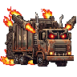

# Project Game 2D Mid Term (CP410844) Computer Game Development By AI-Group-17
Development Game-2D Version Demo

**Member of AI Group-17**

663380290-8	นายภูมิพัฒน์ จำเริญเนาว์	AI1

663380526-5	นายปุณยธร พิทักษ์เผ่าสกุล	AI1

663380255-0	นายคณิศร ตรีศาสตร์	AI1

## ชื่อเกม Red And Blue

ธีม หรือ แนวเกม : เกมแนมโรบอทที่เอาตัวรอดจากโรงงานขยะและพวกเศษเหล็ก 
มุมมองด้านข้าง (Side-scrolling), Post-Apocalyptic(โลกหลังหายนะ), 
Action(ต่อสู้), Adventure(ผจญภัย)

## เนื้อเรื่องย่อ:

ในโลกอนาคตอันไกลโพ้น…มนุษย์ได้ล่มสลายจากโลกเพราะความโลภและขยะอิเล็กทรอนิกส์ล้นโลก จนสิ่งมีชีวิตเพียงอย่างเดียวที่ยัง “เคลื่อนไหว” ได้ คือหุ่นกระป๋องรีไซเคิลรุ่นเก่าๆ Red และ Blue ที่ถูกทิ้งในโรงงานขยะร้าง

เมื่อระบบควบคุมกลางของโรงงานขยะเกิดข้อผิดพลาด โรงงานเริ่มทำลายทุกสิ่งที่ “เคลื่อนไหว” โดยคิดว่าเป็นขยะที่ต้องกำจัด หุ่นกระป๋องผู้เหลือรอดจึงต้องเอาชีวิตรอด ฝ่าด่านอันตรายจากกับดัก มอนสเตอร์เศษเหล็ก และระบบอัตโนมัติของโรงงาน เพื่อค้นหาทางออกสู่ “โลกภายนอก” ที่อาจยังมีสิ่งชีวิตที่หลงเหลืออยู่

## ทดลองเล่น

## Screenshots

## ส่วนประกอบตัวละคร

 Red
 Blue
 ป๋องบิน
 ถังสนิม
 รถเก็บขยะ

## Credits

**Game Template มาจาก** 2D Platformer Demo - Godot Asset Library

**TileMap  มาจาก** 2D Platformer Demo - Godot Asset Library, https://itch.io, https://opengameart.org

**Character มาจาก** https://www.piskelapp.com/

**Fonts มาจาก** https://itch.io

**Sound Effect มาจาก** https://pixabay.com/

**Sound Background มาจาก** https://pixabay.com และ https://pixabay.com/

**Background มาจาก** https://aistudio.google.com/
